## git config --global user.name

**Syntax**

git config --global user.name "Your Name"

**Purpose**

Sets global username for commits.

**Example**

git config --global user.name "afsheen-220147"

**Screenshot**

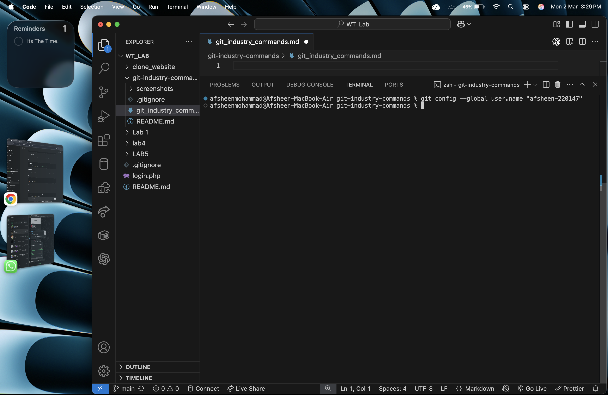

## git config --global user.email

**Syntax**

git config --global user.email "Your Email"

**Purpose**

Sets global username for commits.

**Example**

git config --global user.name "n220147@rguktn.ac.in"

**Screenshot**

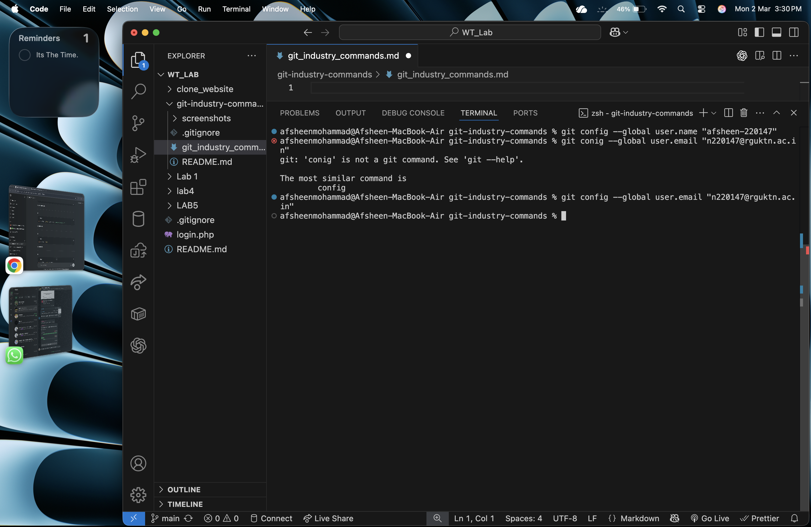

## git config --list

**Syntax**

git config --list

**Purpose**

Displays all the available features of the repo

**Screenshot**
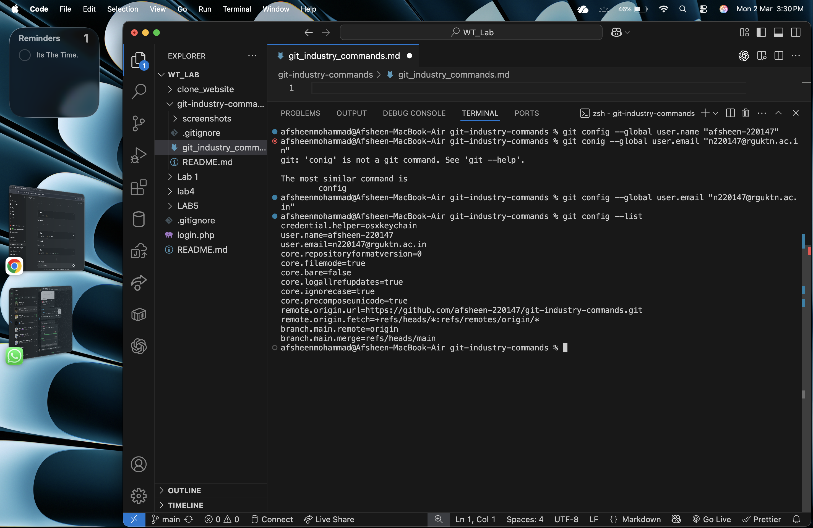

## git config --global --unset user.name

**Syntax**

git config --global --unset user.name

**Purpose**

unSets global username for commits.

**Example**

git config --global --unset user.name 

**Screenshot**

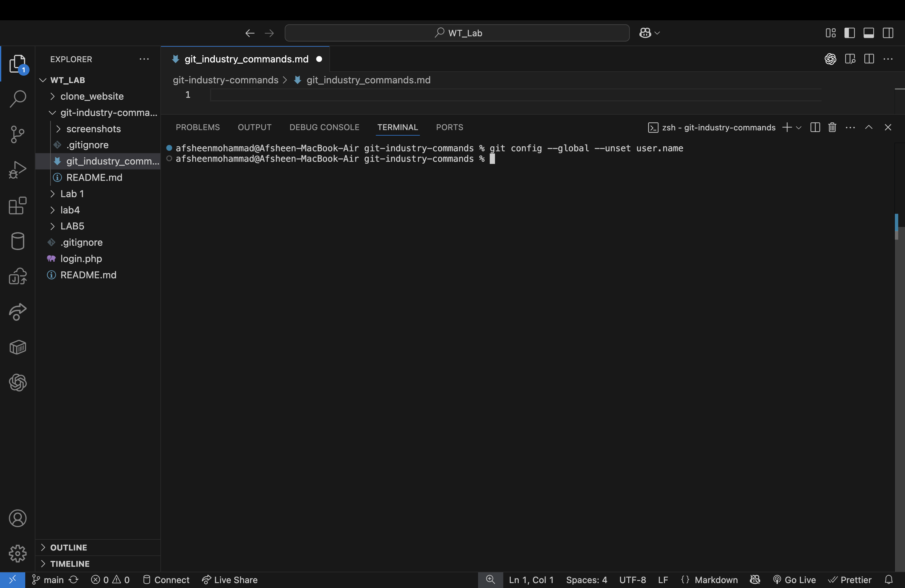

## git init

**Syntax**

git init

**Purpose**

Initializes a new Git repository.

**Example**

git init

**Screenshot**

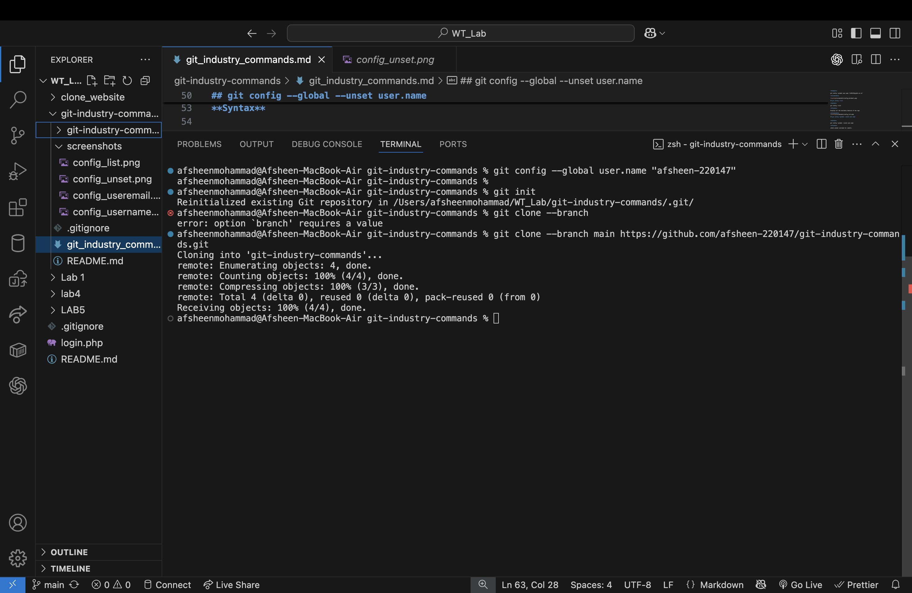

## git clone --branch

**Syntax**

git clone --branch branchname repolink

**Purpose**

clones the git branch

**Example**
git clone --branch main https://github.com/afsheen-220147/git-industry-commands.git
**Screenshot**

## git clone --depth

**Syntax**

git clone --depth <depth> <repository-url>

**Purpose**

Performs a shallow clone with limited commit history.

**Example**

git clone --depth 1 https://github.com/afsheen-220147/git-industry-commands.git

**Screenshot**

## git status

**Syntax**

git status

**Purpose**

Shows the current status of files in the repository.

**Example**

git status

**Screenshot**

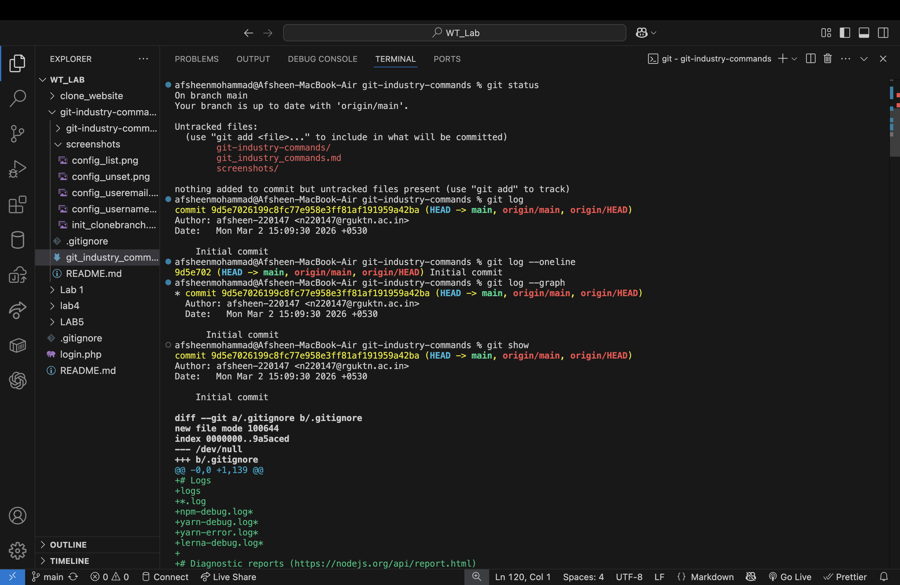

## git log

**Syntax**

git log

**Purpose**

Displays the commit history of the repository.

**Screenshot**

## git log --oneline

**Syntax**

git log --oneline

**Purpose**

Shows commit history in a compact single-line format.

**Screenshot**

## git log --graph

**Syntax**

git log --graph

**Purpose**

Displays commit history as a visual branch graph.

**Screenshot**

## git status

**Syntax**

git status

**Purpose**

Shows the current status of files in the repository.

**Example**

git status

**Screenshot**

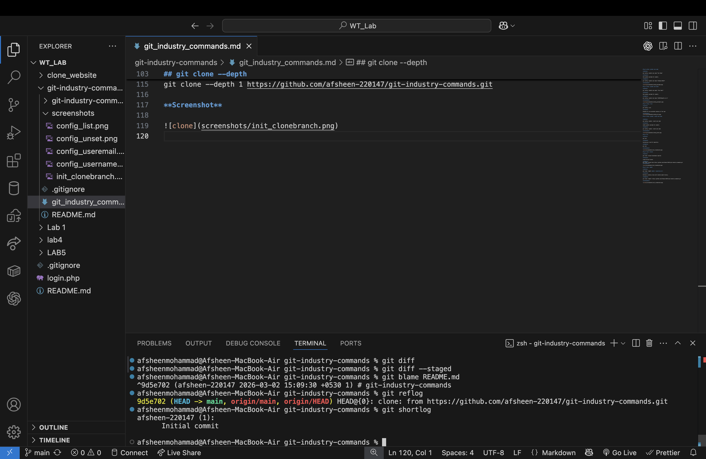

## git log

**Syntax**

git log

**Purpose**

Displays the commit history of the repository.

**Screenshot**

## git log --oneline

**Syntax**

git log --oneline

**Purpose**

Shows commit history in a compact single-line format.

**Screenshot**

## git log --graph

**Syntax**

git log --graph

**Purpose**

Displays commit history as a visual branch graph.

**Screenshot**

## git add

**Syntax**

git add <file-name>

**Purpose**

Adds a specific file to the staging area so it will be included in the next commit.

**Example**

git add demo.txt

## git add .

**Syntax**

git add .

**Purpose**

Adds all modified and new files in the current directory to the staging area.

**Example**

git add .

## git add -p

**Syntax**

git add -p

**Purpose**

Allows interactive staging of changes. It lets you choose specific parts of files to stage.

**Example**

git add -p

## git restore

**Syntax**

git restore <file-name>

**Purpose**

Restores a file in the working directory to its last committed state.

**Example**

git restore demo.txt

## git restore --staged

**Syntax**

git restore --staged <file-name>

**Purpose**

Removes a file from the staging area but keeps it in the working directory.

**Example**

git restore --staged demo.txt

## git rm

**Syntax**

git rm <file-name>

**Purpose**

Removes a file from both the working directory and the Git repository.

**Example**

git rm demo.txt

## git mv

**Syntax**

git mv <old-file-name> <new-file-name>

**Purpose**

Moves or renames a file and automatically stages the change.

**Example**

git mv old.txt new.txt

## git commit

**Syntax**

git commit

**Purpose**

Creates a commit by saving staged changes to the repository, after adding.

**Example**

git commit

**Screenshot**

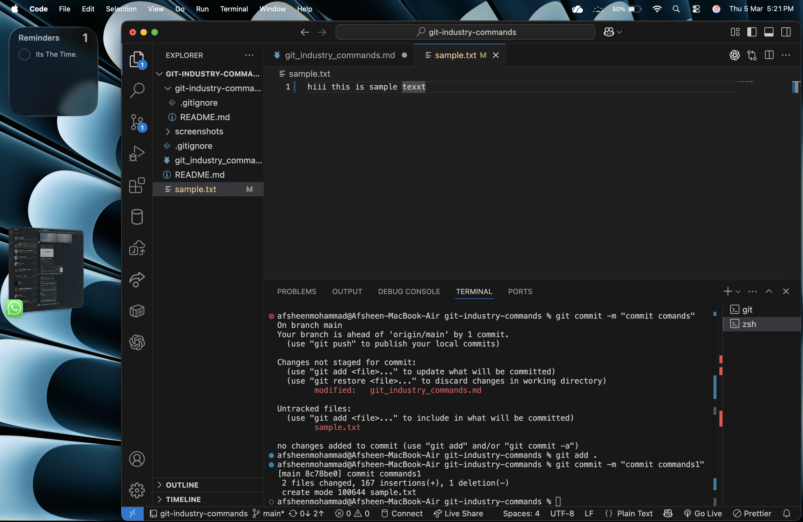

---

## git commit -m

**Syntax**

git commit -m "commit message"

**Purpose**

Creates a commit with a message directly from the terminal.

**Example**

git commit -m "Added commit_demo.txt file"

**Screenshot**

## git commit --amend

**Syntax**

git commit --amend

**Purpose**

Modifies the most recent commit by changing its message or adding new changes.

**Example**

git commit --amend

**Screenshot**

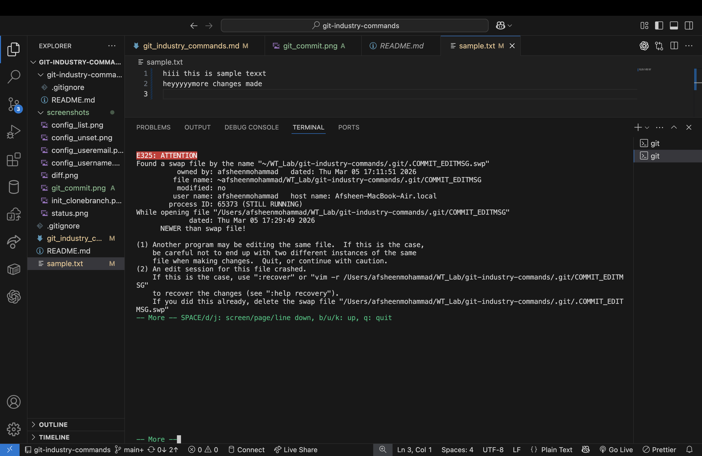

## git commit --amend --no-edit

**Syntax**

git commit --amend --no-edit

**Purpose**

Updates the most recent commit without changing the commit message.

**Example**

git commit --amend --no-edit

**Screenshot**

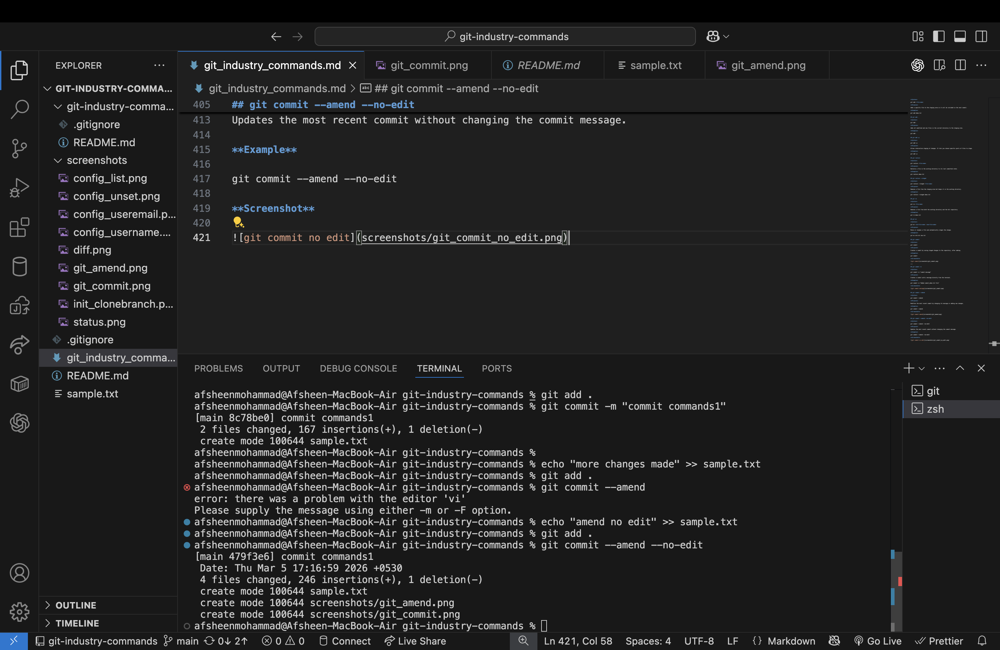

## git branch

**Syntax**

git branch

**Purpose**

Lists all local branches in the repository.

**Example**

git branch

**Screenshot**

## git branch -a

**Syntax**

git branch -a

**Purpose**

Displays all branches including local and remote branches.

**Example**

git branch -a

## git branch -d

**Syntax**

git branch -d <branch-name>

**Purpose**

Deletes a branch safely. Git will prevent deletion if the branch contains unmerged changes.

**Example**

git branch -d feature1

## git branch -D

**Syntax**

git branch -D <branch-name>

**Purpose**

Force deletes a branch even if it contains unmerged changes.

**Example**

git branch -D feature2

## git checkout

**Syntax**

git checkout <branch-name>

**Purpose**

Switches from the current branch to another existing branch.

**Example**

git checkout main

## git checkout -b

**Syntax**

git checkout -b <branch-name>

**Purpose**

Creates a new branch and immediately switches to it.

**Example**

git checkout -b feature1

## git switch

**Syntax**

git switch <branch-name>

**Purpose**

Switches to another branch using the modern Git command introduced as a safer alternative to checkout.

**Example**

git switch main

## git switch -c

**Syntax**

git switch -c <branch-name>

**Purpose**

Creates a new branch and switches to it using the newer Git switch command.

**Example**

git switch -c feature2

# Merge & Integration Commands

## git merge

**Syntax**

git merge <branch-name>

**Purpose**

Combines changes from another branch into the current branch.

**Example**

git merge feature_merge

**Screenshot**

## git merge --no-ff

**Syntax**

git merge --no-ff <branch-name>

**Purpose**

Performs a merge while always creating a merge commit, even when a fast-forward merge is possible.

**Example**

git merge --no-ff feature_noff

**Screenshot**

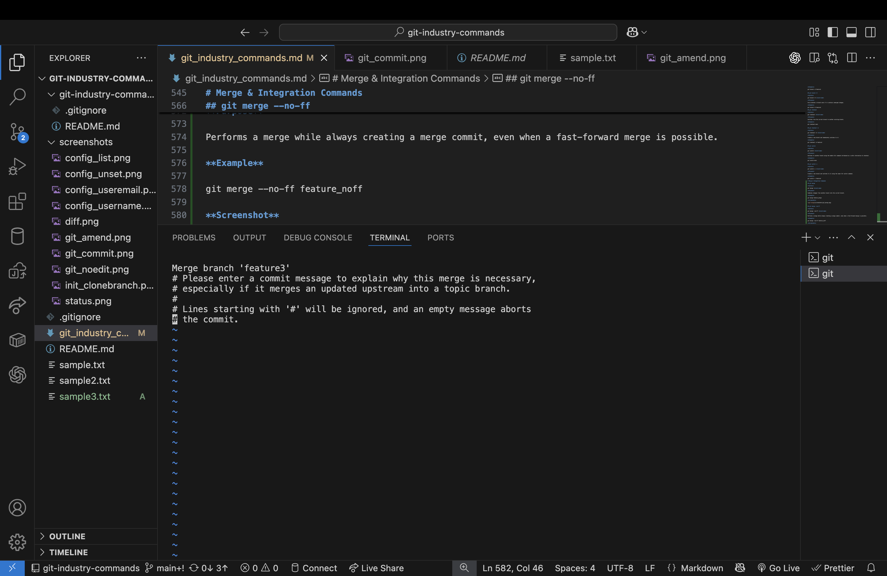

# Remote Repository Commands

## git remote

**Syntax**

git remote

**Purpose**

Displays the list of remote repositories connected to the local repository.

**Example**

git remote

**Screenshot**

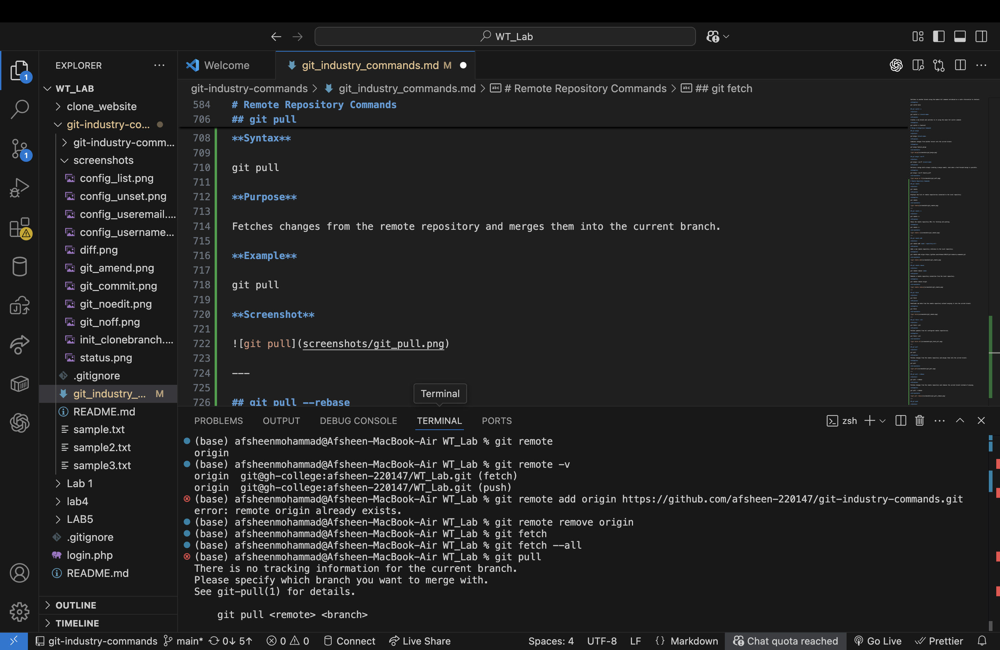

---

## git remote -v

**Syntax**

git remote -v

**Purpose**

Shows the remote repository URLs for fetching and pushing.

**Example**

git remote -v

**Screenshot**

---

## git remote add

**Syntax**

git remote add <name> <repository-url>

**Purpose**

Adds a new remote repository reference to the local repository.

**Example**

git remote add origin https://github.com/afsheen-220147/git-industry-commands.git

**Screenshot**

---

## git remote remove

**Syntax**

git remote remove <name>

**Purpose**

Removes a remote repository connection from the local repository.

**Example**

git remote remove origin

**Screenshot**

---

## git fetch

**Syntax**

git fetch

**Purpose**

Downloads new data from the remote repository without merging it into the current branch.

**Example**

git fetch

**Screenshot**

---

## git fetch --all

**Syntax**

git fetch --all

**Purpose**

Fetches updates from all configured remote repositories.

**Example**

git fetch --all

**Screenshot**

---

## git pull

**Syntax**

git pull

**Purpose**

Fetches changes from the remote repository and merges them into the current branch.

**Example**

git pull

## git pull --rebase

**Syntax**

git pull --rebase

**Purpose**

Fetches changes from the remote repository and rebases the current branch instead of merging.

**Example**

git pull --rebase

## git push

**Syntax**

git push

**Purpose**

Uploads local commits to the remote repository.

**Example**

git push

## git push -u origin branch-name

**Syntax**

git push -u origin <branch-name>

**Purpose**

Pushes a branch to the remote repository and sets the upstream tracking reference.

**Example**

git push -u origin main

## git push --force

**Syntax**

git push --force

**Purpose**

Forces an update to the remote repository, overwriting history if necessary.

**Example**

git push --force

# Stash Commands

## git stash
**Syntax**  
git stash  

**Purpose**  
Temporarily saves uncommitted changes in the working directory and reverts the files to the last committed state.

**Example**  
git stash

---

## git stash list
**Syntax**  
git stash list  

**Purpose**  
Displays the list of all saved stashes.

**Example**  
git stash list

---

## git stash pop
**Syntax**  
git stash pop  

**Purpose**  
Applies the most recent stash and removes it from the stash list.

**Example**  
git stash pop

---

## git stash apply
**Syntax**  
git stash apply  

**Purpose**  
Applies a stash without removing it from the stash list.

**Example**  
git stash apply

---

## git stash drop
**Syntax**  
git stash drop stash@{0}  

**Purpose**  
Deletes a specific stash entry.

**Example**  
git stash drop stash@{0}

---

## git stash clear
**Syntax**  
git stash clear  

**Purpose**  
Deletes all stashes stored in the repository.

**Example**  
git stash clear

---

# Reset & Undo Commands

## git reset
**Syntax**  
git reset  

**Purpose**  
Unstages files while keeping the changes in the working directory.

**Example**  
git reset demo.txt

---

## git reset --soft
**Syntax**  
git reset --soft HEAD~1  

**Purpose**  
Moves HEAD to a previous commit but keeps all changes staged.

**Example**  
git reset --soft HEAD~1

---

## git reset --mixed
**Syntax**  
git reset --mixed HEAD~1  

**Purpose**  
Moves HEAD to a previous commit and unstages the changes.

**Example**  
git reset --mixed HEAD~1

---

## git reset --hard
**Syntax**  
git reset --hard HEAD~1  

**Purpose**  
Moves HEAD to a previous commit and removes all working directory changes.

**Example**  
git reset --hard HEAD~1

---

## git revert
**Syntax**  
git revert <commit-id>  

**Purpose**  
Creates a new commit that reverses changes introduced by a previous commit.

**Example**  
git revert HEAD

---

## git clean -f
**Syntax**  
git clean -f  

**Purpose**  
Removes untracked files from the working directory.

**Example**  
git clean -f

---

## git clean -fd
**Syntax**  
git clean -fd  

**Purpose**  
Removes untracked files and directories from the working directory.

**Example**  
git clean -fd

---

# Rebasing Commands

## git rebase
**Syntax**  
git rebase <branch-name>  

**Purpose**  
Reapplies commits from the current branch onto another base branch.

**Example**  
git rebase main

---

## git rebase -i
**Syntax**  
git rebase -i HEAD~3  

**Purpose**  
Starts an interactive rebase to edit, reorder, or squash commits.

**Example**  
git rebase -i HEAD~3

---

## git rebase --continue
**Syntax**  
git rebase --continue  

**Purpose**  
Continues the rebase process after resolving conflicts.

**Example**  
git rebase --continue

---

## git rebase --abort
**Syntax**  
git rebase --abort  

**Purpose**  
Stops the rebase operation and returns the branch to its previous state.

**Example**  
git rebase --abort

---

# Cherry Pick & Patch Commands

## git cherry-pick
**Syntax**  
git cherry-pick <commit-id>  

**Purpose**  
Applies a specific commit from another branch to the current branch.

**Example**  
git cherry-pick 3a4b5c

---

## git format-patch
**Syntax**  
git format-patch HEAD~1  

**Purpose**  
Creates patch files from commits.

**Example**  
git format-patch HEAD~1

---

## git apply
**Syntax**  
git apply <patch-file>  

**Purpose**  
Applies the changes from a patch file to the working directory.

**Example**  
git apply update.patch

---

## git am
**Syntax**  
git am <patch-file>  

**Purpose**  
Applies patches generated by format-patch and records them as commits.

**Example**  
git am update.patch

---

# Tagging Commands

## git tag
**Syntax**  
git tag  

**Purpose**  
Lists all tags in the repository.

**Example**  
git tag

## git tag -a
**Syntax**  
git tag -a v1.0 -m "Release version 1.0"  

**Purpose**  
Creates an annotated tag for a specific commit.

**Example**  
git tag -a v1.0 -m "Release version 1.0 by afsheen-220147"

## git tag -d
**Syntax**  
git tag -d v1.0  

**Purpose**  
Deletes a tag from the repository.

**Example**  
git tag -d v1.0

## git push origin --tags
**Syntax**  
git push origin --tags  

**Purpose**  
Pushes all local tags to the remote repository.

**Example**  
git push origin --tags

# Submodule Commands

## git submodule add
**Syntax**  
git submodule add <repository-url>  

**Purpose**  
Adds another repository as a submodule inside the current project.

**Example**  
git submodule add https://github.com/afsheen-220147/git-industry-commands.git

## git submodule init
**Syntax**  
git submodule init  

**Purpose**  
Initializes local configuration for submodules.

**Example**  
git submodule init

## git submodule update
**Syntax**  
git submodule update  

**Purpose**  
Fetches and checks out the correct commit for submodules.

**Example**  
git submodule update

# Debugging Commands

## git bisect
**Syntax**  
git bisect  

**Purpose**  
Starts the process of identifying the commit that introduced a bug.

**Example**  
git bisect start

## git bisect start
**Syntax**  
git bisect start  

**Purpose**  
Begins the binary search process for finding a faulty commit.

**Example**  
git bisect start

## git bisect good
**Syntax**  
git bisect good <commit-id>  

**Purpose**  
Marks a commit as good during the debugging process.

**Example**  
git bisect good 1a2b3c

## git bisect bad
**Syntax**  
git bisect bad <commit-id>  

**Purpose**  
Marks a commit as bad to help locate the bug.

**Example**  
git bisect bad 4d5e6f